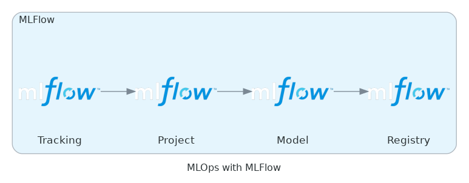

# ML Flow
by Omar Kamal

---

# Introduction to MLflow

---
## What is MLflow?
- MLflow is an open-source platform for managing the machine learning lifecycle.
- Provides solutions for challenges in model engineering, evaluation, and deployment.
### The machine learning lifecycle
- The machine learning lifecycle follows similar principles as software development.
- Additional steps include model engineering, evaluation, and deployment.
#### What does MLflow offer?
- Offers experiment tracking, reproducibility, deployment, and a centralized model
registry.
